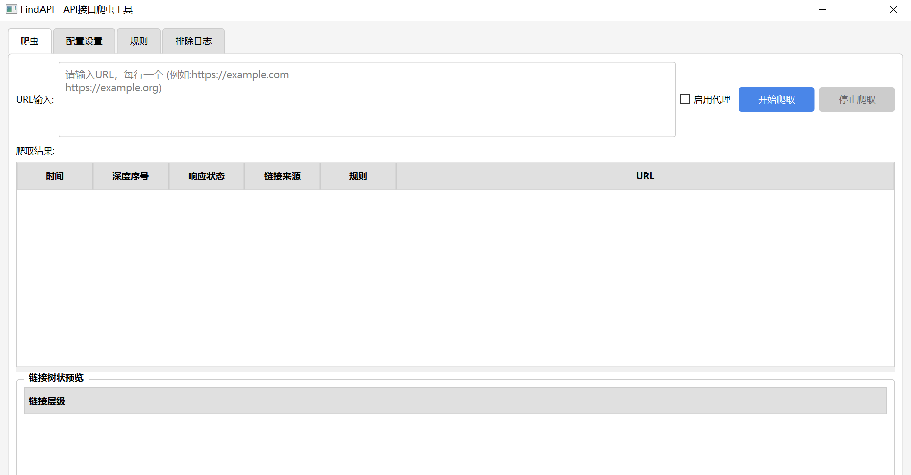
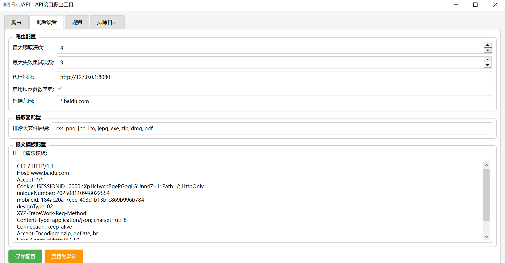

# FindAPI - 网页API爬取工具

FindAPI是一个功能强大的网页API爬取工具，专为发现和提取网站中的API端点而设计。通过智能爬取和分析网页内容，FindAPI能够识别潜在的API端点，帮助开发者和安全研究人员更高效地进行API发现和分析。

## 功能特点

- **智能爬取**：自动爬取指定网站并分析页面内容
- **API端点识别**：基于规则自动识别潜在的API端点
- **可视化界面**：直观的图形用户界面，便于操作和结果查看
- **自定义规则**：支持通过YAML配置文件自定义爬取和识别规则
- **灵活配置**：可配置爬取深度、并发数、请求间隔等参数
- **日志记录**：详细记录爬取过程，便于分析和调试

支持批量url导入

支持请求模板修改(添加登录会话,修改校验特征)。支持代理(导入请求burpsuite分析,如HaE检测敏感信息)

## 系统要求

- Python 3.6+
- PySide6
- 其他依赖项（见安装说明）

## 安装说明

1. 克隆仓库到本地：

```bash
git clone https://github.com/yourusername/findapi.git
cd findapi
```

2. 安装依赖项：

```bash
pip install -r requirements.txt
```

## 使用方法

### 启动图形界面

```bash
python run_ui.py
```

### 使用界面

1. **爬虫标签页**：
   - 输入起始URL
   - 设置爬取参数（深度、并发数等）
   - 点击"开始爬取"按钮开始爬取过程
   - 实时查看爬取进度和结果

2. **规则标签页**：
   - 查看和编辑API识别规则
   - 添加新规则或修改现有规则

3. **配置设置标签页**：
   - 调整全局配置参数
   - 保存配置到配置文件

4. **排除日志标签页**：
   - 查看排除的URL和原因
   - 管理排除规则

### 配置文件

项目使用两个主要配置文件：

1. **config.ini**：存储全局配置参数
   - 爬取设置（深度、并发数、超时等）
   - 输出设置
   - 日志设置

2. **rules.yml**：定义API识别规则
   - URL模式匹配规则
   - 内容分析规则
   - 排除规则

## 项目结构

```
findapi/
├── config.ini          # 配置文件
├── config.py           # 配置管理器
├── core/               # 核心功能模块
│   ├── __init__.py
│   └── crawler_controller.py  # 爬虫控制器
├── link_extractor.py   # 链接提取器
├── log.py              # 日志管理
├── message/            # 消息模板
├── messageparse.py     # 消息解析器
├── README.md           # 项目说明文档
├── rules.yml           # 规则配置文件
├── run_ui.py           # UI启动入口
├── ui/                 # 用户界面
│   ├── __init__.py
│   ├── main_window.py  # 主窗口
│   └── views/          # 各视图组件
│       ├── __init__.py
│       ├── config_settings_tab.py  # 配置设置标签页
│       ├── crawler_tab.py          # 爬虫标签页
│       ├── exclude_logs_tab.py     # 排除日志标签页
│       └── rules_tab.py            # 规则标签页
└── web_crawler.py      # 爬虫核心实现
```

## 自定义规则

在`rules.yml`文件中，您可以自定义API识别规则,以及API排除规则：

```yaml
# 识别规则
  rule:
  - f_regex: src\s*=\s*["']([\w/\?=#;,\.\-_:&;]+)["']
    name: src
    sensitive: false
  - f_regex: href\s*=\s*["']([\w/\?=#;,\.\-_:&;]+)["']
    name: href
    sensitive: false
  - f_regex: (http[s]?://[\w/\?=#;,\.\-_:&;]+)
    name: http
    sensitive: false
```
```yaml
# 排除规则
  rule:
  - f_regex: (javascript|data|del|about):.*?
    name: PseudoProtocols
    sensitive: false
  - f_regex: (Y{0,4}/?M{1,2}/D{1,2}/?Y{0,4})
    name: time
    sensitive: false
  - enabled: true
    f_regex: (text|application|multipart)\/(css|plain|javascript|x-www-form-urlencoded|octet-stream|json|html|form-data)
    name: contentType
    sensitive: false
```


## 联系方式

如有问题或建议，请通过以下方式联系我们：

- 项目Issues页面：[https://github.com/zx197009220/findApi/issues](https://github.com/yourusername/findapi/issues)

---

**注意**：本工具仅用于合法的API发现和安全研究目的。请在获得适当授权的情况下使用，并遵守相关法律法规和网站的使用条款。
